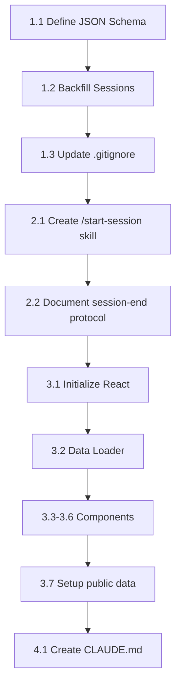

# feat: Build CSMLS V1 Meta-Learning System

## Overview

Build the Claude School Meta-Learning System (CSMLS) V1 - a file-first architecture that tracks learning progress through the 6-stage agentic engineering roadmap, maintains session continuity via structured JSON summaries, and displays status in a minimal React dashboard.

**Architecture:** File-First (no backend)
- JSON files for machine-readable data
- Markdown files for human-readable logs
- React reads files statically at load time
- `/start-session` skill for explicit context loading

## Problem Statement / Motivation

Currently, each Claude Code session starts fresh with no memory of previous learning sessions. The learner must manually re-explain context, and there's no visual way to track progress through the 6-stage roadmap.

CSMLS V1 solves this by:
1. **Structured session summaries** - JSON files Claude can parse to restore context
2. **Explicit session boundaries** - `/start-session` skill triggers context loading
3. **Visual progress tracking** - React dashboard shows roadmap position

## Technical Approach

### Session State Machine

```
┌──────────┐  /start-session   ┌─────────────┐  "end session"   ┌──────────┐
│ (no file)│ ───────────────>  │ in-progress │ ───────────────> │ complete │
└──────────┘                   └─────────────┘                  └──────────┘
                                      │
                                      │ (session abandoned - terminal closed)
                                      v
                                 (file stays in-progress,
                                  next /start-session resumes)
```

**Status values:** `"in-progress"` | `"complete"`

**Rules:**
- `/start-session` creates new session file with `"in-progress"` if current session file doesn't exist
- `/start-session` resumes if current session file exists and is `"in-progress"`
- Session end changes status to `"complete"` and increments `progress.json.currentSession`

### Data Flow

```
Session Start:
  Human types "/start-session"
    → Skill reads progress.json (get currentSession=N)
    → Skill reads session-{N-1}.json (previous session context)
    → Skill reads session-{N}.json (if exists, resume)
    → Skill outputs formatted summary to Claude
    → If new session: creates session-{N}.json with status="in-progress"

Session End:
  Human says "end session" or "let's wrap up"
    → Claude generates session-{N}.json (status="complete")
    → Claude generates logs/session-{N}.md
    → Claude updates progress.json (increment currentSession, add to completedSessions)
    → Claude evaluates quality gates if applicable

Dashboard View:
  Human opens browser to localhost:3000
    → React loads progress.json
    → React loads quality-gates.json
    → React loads latest session-{N}.json
    → Renders roadmap + session summary
```

### File Structure (Final State)

```
claude-school-system/
├── data/
│   ├── progress.json           # Existing - roadmap position
│   ├── quality-gates.json      # Existing - gate definitions
│   └── sessions/
│       ├── session-01.json     # NEW - backfill from session-01.md
│       ├── session-02.json     # NEW - backfill from session-02.md
│       └── ...
├── logs/
│   ├── session-01.md           # Existing - narrative
│   └── session-02.md           # Existing - narrative
├── src/
│   ├── App.jsx                 # NEW - React entry
│   ├── components/
│   │   ├── Dashboard.jsx       # NEW - main view
│   │   ├── RoadmapStages.jsx   # NEW - 6-stage visualization
│   │   └── SessionSummary.jsx  # NEW - last session display
│   └── utils/
│       └── dataLoader.js       # NEW - JSON file loading
├── skills/
│   └── start-session.md        # NEW - skill definition
├── package.json                # NEW - React dependencies
├── CLAUDE.md                   # NEW - project context
└── .gitignore                  # UPDATE - add Node.js patterns
```

## Proposed Solution

### Phase 1: Data Foundation

- [x] 1.1 Create Session JSON Schema
- [x] 1.2 Backfill Existing Sessions
- [x] 1.3 Update .gitignore

### Phase 2: Skill Implementation

- [x] 2.1 Create /start-session Skill
- [x] 2.2 Document session-end protocol in CLAUDE.md

### Phase 3: React Dashboard

- [x] 3.1 Initialize React Project
- [x] 3.2 Create Data Loader Utility
- [x] 3.3 Build Dashboard Component
- [x] 3.4 Build RoadmapStages Component
- [x] 3.5 Build SessionSummary Component
- [x] 3.6 Update App.jsx and Configure Vite

## Testing & Verification

- [x] All tasks completed
- [x] JSON files validated
- [x] React dashboard runs successfully (port 5174)
- [x] Data files accessible in public directory
- [x] README.md updated with complete documentation

#### 1.1 Create Session JSON Schema

**File:** `data/sessions/session-{NN}.json`

```json
{
  "sessionNumber": 2,
  "date": "2026-01-30",
  "status": "complete",
  "stage": 1,
  "title": "Git Fundamentals",
  "skillsDemonstrated": [
    "git-status",
    "git-add",
    "git-commit",
    "commit-workflow"
  ],
  "openQuestions": [],
  "nextObjectives": [
    "Learn git branching",
    "Practice git diff"
  ],
  "filesModified": [
    "logs/session-02.md",
    "data/progress.json"
  ],
  "keyInsights": [
    "Git tracks changes, not files",
    "Staging area allows selective commits"
  ],
  "duration": "2 hours"
}
```

**Field definitions:**
| Field | Type | Required | Description |
|-------|------|----------|-------------|
| sessionNumber | number | Yes | Session identifier (1-indexed) |
| date | string | Yes | ISO date YYYY-MM-DD |
| status | enum | Yes | "in-progress" or "complete" |
| stage | number | Yes | Current roadmap stage (1-6) |
| title | string | Yes | Human-readable session title |
| skillsDemonstrated | string[] | Yes | Skills practiced (can be empty) |
| openQuestions | string[] | Yes | Unresolved questions (can be empty) |
| nextObjectives | string[] | Yes | Goals for next session |
| filesModified | string[] | Yes | Relative paths from repo root |
| keyInsights | string[] | No | Notable learnings |
| duration | string | No | Approximate session length |

#### 1.2 Backfill Existing Sessions

Create `data/sessions/session-01.json` and `session-02.json` from existing markdown logs.

**session-01.json:**
```json
{
  "sessionNumber": 1,
  "date": "2026-01-25",
  "status": "complete",
  "stage": 1,
  "title": "Environment Setup and First CLI App",
  "skillsDemonstrated": [
    "nodejs-setup",
    "npm-init",
    "file-io",
    "json-persistence",
    "cli-arguments"
  ],
  "openQuestions": [],
  "nextObjectives": [
    "Learn Git fundamentals",
    "Create repository for task-tracker"
  ],
  "filesModified": [
    "logs/session-01.md"
  ],
  "keyInsights": [
    "Context is 70% of output quality",
    "Ordered feature lists prevent scope creep"
  ],
  "duration": "3 hours"
}
```

**session-02.json:**
```json
{
  "sessionNumber": 2,
  "date": "2026-01-30",
  "status": "complete",
  "stage": 1,
  "title": "Git Fundamentals",
  "skillsDemonstrated": [
    "git-init",
    "git-status",
    "git-add",
    "git-commit",
    "git-remote",
    "git-push",
    "gitignore"
  ],
  "openQuestions": [],
  "nextObjectives": [
    "Learn git branching",
    "Practice git diff",
    "Start CSMLS V1"
  ],
  "filesModified": [
    "logs/session-02.md",
    "data/progress.json"
  ],
  "keyInsights": [
    "Git tracks content changes, not file existence",
    "Staging area enables selective commits",
    "Remote origin enables persistence and collaboration"
  ],
  "duration": "2 hours"
}
```

#### 1.3 Update .gitignore

```gitignore
# Existing
workspace/
*.code-workspace

# Node.js
node_modules/
build/
dist/
.env
.env.local

# IDE
.idea/
*.swp
```

### Phase 2: Skill Implementation

#### 2.1 Create /start-session Skill

**File:** `skills/start-session.md`

```markdown
---
name: start-session
description: Load previous session context to restore learning continuity
triggers:
  - /start-session
  - start a learning session
  - continue learning
---

# /start-session

Load context from the Claude School Meta-Learning System to continue the agentic engineering learning journey.

## What This Skill Does

1. Reads `data/progress.json` to get current stage and session number
2. Reads the previous session's JSON file for context
3. Checks if current session is in-progress (resume) or needs creation
4. Presents a formatted summary to start the session

## Instructions for Claude

When /start-session is triggered:

### Step 1: Read Progress Data

Read `data/progress.json` and extract:
- `currentStage` (which stage of the 6-stage roadmap)
- `currentSession` (session number to work on)
- `completedSessions` (which sessions are done)

### Step 2: Load Previous Session Context

If `currentSession > 1`:
- Read `data/sessions/session-{currentSession - 1}.json`
- Extract: `nextObjectives`, `openQuestions`, `keyInsights`

### Step 3: Check Current Session State

Check if `data/sessions/session-{currentSession}.json` exists:
- **If exists with status="in-progress"**: Resuming interrupted session
- **If exists with status="complete"**: Error state (session already done)
- **If doesn't exist**: New session starting

### Step 4: Create Session File (If New)

If starting new session, create `data/sessions/session-{currentSession}.json`:
```json
{
  "sessionNumber": {currentSession},
  "date": "{today's date YYYY-MM-DD}",
  "status": "in-progress",
  "stage": {currentStage},
  "title": "",
  "skillsDemonstrated": [],
  "openQuestions": [],
  "nextObjectives": [],
  "filesModified": [],
  "keyInsights": []
}
```

### Step 5: Output Session Summary

Present this information to start the session:

```
═══════════════════════════════════════════════════════════════
                    CLAUDE SCHOOL - SESSION {N}
═══════════════════════════════════════════════════════════════

ROADMAP POSITION
  Stage: {currentStage} - {stageName}
  Session: {currentSession} of 20
  Progress: {completedSessions.length}/20 sessions complete

FROM LAST SESSION
  Title: {previousSession.title}
  Date: {previousSession.date}

  Key Insights:
  {list keyInsights}

  Open Questions:
  {list openQuestions or "None"}

TODAY'S OBJECTIVES
  {list previousSession.nextObjectives}

STATUS: {New session | Resuming in-progress session}
═══════════════════════════════════════════════════════════════
```

## Error Handling

**If progress.json missing:**
> "Cannot find progress.json. Please ensure the data/ directory exists with valid progress tracking files."

**If previous session file missing:**
> "Note: Previous session file not found. Starting fresh with no prior context."

**If data/sessions/ directory missing:**
Create it before writing the new session file.
```

#### 2.2 Document Session-End Protocol

Add to CLAUDE.md the instructions for ending a session:

**When the human says "end session", "let's wrap up", or similar:**

1. Generate `data/sessions/session-{N}.json` with:
   - `status: "complete"`
   - `skillsDemonstrated`: List skills practiced this session
   - `openQuestions`: Any unresolved questions
   - `nextObjectives`: Goals for next session
   - `filesModified`: Files changed this session
   - `keyInsights`: Notable learnings
   - `title`: Brief session title
   - `duration`: Approximate time spent

2. Generate `logs/session-{N}.md` following the established format

3. Update `data/progress.json`:
   - Add `N` to `completedSessions` array
   - Increment `currentSession` by 1

4. Evaluate quality gates if approaching a gate threshold

### Phase 3: React Dashboard

#### 3.1 Initialize React Project

```bash
npm create vite@latest . -- --template react
npm install
```

#### 3.2 Create Data Loader Utility

**File:** `src/utils/dataLoader.js`

```javascript
// Load JSON files for dashboard display
// Note: In development, Vite serves files from public/

export async function loadDashboardData() {
  try {
    const [progress, gates, latestSession] = await Promise.all([
      fetch('/data/progress.json').then(r => r.json()),
      fetch('/data/quality-gates.json').then(r => r.json()),
      loadLatestSession()
    ]);

    return { progress, gates, latestSession };
  } catch (error) {
    console.error('Failed to load dashboard data:', error);
    return null;
  }
}

async function loadLatestSession() {
  // Try loading sessions in reverse order until we find one
  for (let i = 20; i >= 1; i--) {
    try {
      const session = await fetch(`/data/sessions/session-${String(i).padStart(2, '0')}.json`);
      if (session.ok) {
        return session.json();
      }
    } catch {
      continue;
    }
  }
  return null;
}

export function calculateProgress(progress) {
  const totalSessions = 20;
  const completed = progress.completedSessions?.length || 0;
  return Math.round((completed / totalSessions) * 100);
}
```

#### 3.3 Create Dashboard Component

**File:** `src/components/Dashboard.jsx`

```jsx
import { useState, useEffect } from 'react';
import { loadDashboardData, calculateProgress } from '../utils/dataLoader';
import RoadmapStages from './RoadmapStages';
import SessionSummary from './SessionSummary';
import './Dashboard.css';

export default function Dashboard() {
  const [data, setData] = useState(null);
  const [loading, setLoading] = useState(true);
  const [error, setError] = useState(null);

  useEffect(() => {
    loadDashboardData()
      .then(result => {
        if (result) {
          setData(result);
        } else {
          setError('Failed to load data');
        }
        setLoading(false);
      });
  }, []);

  if (loading) {
    return <div className="dashboard loading">Loading...</div>;
  }

  if (error) {
    return <div className="dashboard error">{error}</div>;
  }

  if (!data) {
    return <div className="dashboard empty">No data available</div>;
  }

  const progressPercent = calculateProgress(data.progress);

  return (
    <div className="dashboard">
      <header>
        <h1>Claude School Progress</h1>
        <div className="progress-badge">
          {progressPercent}% Complete
        </div>
      </header>

      <main>
        <section className="roadmap-section">
          <h2>6-Stage Roadmap</h2>
          <RoadmapStages
            stages={data.progress.stages}
            currentStage={data.progress.currentStage}
            completedSessions={data.progress.completedSessions}
          />
        </section>

        <section className="session-section">
          <h2>Current Position</h2>
          <div className="current-info">
            <span>Stage {data.progress.currentStage}</span>
            <span>Session {data.progress.currentSession}</span>
          </div>
        </section>

        {data.latestSession && (
          <section className="summary-section">
            <h2>Last Session</h2>
            <SessionSummary session={data.latestSession} />
          </section>
        )}
      </main>

      <footer>
        <p>Refresh browser to see updates</p>
      </footer>
    </div>
  );
}
```

#### 3.4 Create RoadmapStages Component

**File:** `src/components/RoadmapStages.jsx`

```jsx
export default function RoadmapStages({ stages, currentStage, completedSessions }) {
  return (
    <div className="roadmap-stages">
      {stages.map(stage => {
        const stageComplete = stage.sessions.every(s =>
          completedSessions.includes(s)
        );
        const stageCurrent = stage.id === currentStage;
        const stageProgress = stage.sessions.filter(s =>
          completedSessions.includes(s)
        ).length;

        return (
          <div
            key={stage.id}
            className={`stage ${stageComplete ? 'complete' : ''} ${stageCurrent ? 'current' : ''}`}
          >
            <div className="stage-number">{stage.id}</div>
            <div className="stage-info">
              <h3>{stage.name}</h3>
              <p>{stage.description}</p>
              <div className="stage-progress">
                {stageProgress}/{stage.sessions.length} sessions
              </div>
            </div>
          </div>
        );
      })}
    </div>
  );
}
```

#### 3.5 Create SessionSummary Component

**File:** `src/components/SessionSummary.jsx`

```jsx
export default function SessionSummary({ session }) {
  if (!session) return null;

  return (
    <div className="session-summary">
      <div className="summary-header">
        <span className="session-title">{session.title || `Session ${session.sessionNumber}`}</span>
        <span className="session-date">{session.date}</span>
        <span className={`session-status ${session.status}`}>{session.status}</span>
      </div>

      {session.skillsDemonstrated?.length > 0 && (
        <div className="summary-section">
          <h4>Skills Demonstrated</h4>
          <ul className="skills-list">
            {session.skillsDemonstrated.map((skill, i) => (
              <li key={i}>{skill}</li>
            ))}
          </ul>
        </div>
      )}

      {session.keyInsights?.length > 0 && (
        <div className="summary-section">
          <h4>Key Insights</h4>
          <ul className="insights-list">
            {session.keyInsights.map((insight, i) => (
              <li key={i}>{insight}</li>
            ))}
          </ul>
        </div>
      )}

      {session.nextObjectives?.length > 0 && (
        <div className="summary-section">
          <h4>Next Objectives</h4>
          <ul className="objectives-list">
            {session.nextObjectives.map((obj, i) => (
              <li key={i}>{obj}</li>
            ))}
          </ul>
        </div>
      )}
    </div>
  );
}
```

#### 3.6 Update App Entry Point

**File:** `src/App.jsx`

```jsx
import Dashboard from './components/Dashboard';

function App() {
  return <Dashboard />;
}

export default App;
```

#### 3.7 Setup Public Data Directory

Copy/symlink data files to public directory for Vite to serve:
- Create `public/data/` directory
- Symlink or copy `data/progress.json`, `data/quality-gates.json`, `data/sessions/`

Or configure Vite to serve from project root.

### Phase 4: Project Context

#### 4.1 Create CLAUDE.md

**File:** `CLAUDE.md`

```markdown
# Claude School System

A meta-learning system for tracking progress through the 6-stage agentic engineering roadmap.

## Project Purpose

This repository is a **learning project** where a complete beginner is learning software engineering through Claude Code. The system tracks:
- Progress through a 6-stage roadmap (20 sessions total)
- Quality gates that must be passed to advance
- Session continuity between learning sessions

## Key Files

- `data/progress.json` - Current roadmap position (stage, session, completed sessions)
- `data/quality-gates.json` - Gate definitions and criteria
- `data/sessions/session-{NN}.json` - Machine-readable session summaries
- `logs/session-{NN}.md` - Human-readable session narratives

## Session Workflow

### Starting a Session
Use `/start-session` to load context from previous sessions. This reads progress data and presents a summary of where we left off.

### During a Session
- Work through learning objectives
- Practice skills (recorded in skillsDemonstrated)
- Note any blockers or questions (recorded in openQuestions)

### Ending a Session
When the human says "end session" or "let's wrap up":
1. Generate `data/sessions/session-{N}.json` with complete summary
2. Generate `logs/session-{N}.md` with narrative log
3. Update `data/progress.json` (increment session, mark complete)

## Teaching Context

The learner:
- Is a complete programming beginner
- Prefers comprehensive explanations with the "why" before "how"
- Values understanding principles over memorizing commands
- Environment: Windows, Git Bash, Cursor IDE, Node.js v24.13.0

The 6 stages:
1. Foundation (Sessions 1-6): Core skills, environment
2. Basic Agents (7-9): Sub-agents, hooks intro
3. Validation Patterns (10-12): Self-validating agents
4. Multi-Agent Workflows (13-15): Parallel agents
5. Production Patterns (16-18): Error handling, deployment
6. Advanced Topics (19-20): Custom plugins

## Quality Gate Philosophy

"Don't skip stages. Each stage builds essential skills for the next."

Gates are unlocked by demonstrating specific criteria across sessions. The system tracks which skills have been demonstrated and evaluates gate readiness at session end.
```

## Acceptance Criteria

### Functional Requirements
- [ ] `/start-session` skill loads previous session context and presents summary
- [ ] Session JSON files capture all required fields
- [ ] Session-end workflow generates both JSON and markdown
- [ ] progress.json updates correctly at session end
- [ ] React dashboard displays roadmap with current position highlighted
- [ ] React dashboard shows progress percentage
- [ ] React dashboard shows last session summary

### Non-Functional Requirements
- [ ] Dashboard loads in under 2 seconds
- [ ] JSON files are human-readable (pretty-printed)
- [ ] System works offline (no external API calls)
- [ ] Data files can be version-controlled

### Quality Gates
- [ ] Backfilled session JSONs match existing markdown logs
- [ ] All JSON files validate against schema
- [ ] React components render without errors
- [ ] `/start-session` handles missing files gracefully

## Success Metrics

1. **Session continuity achieved**: Claude can start a session and immediately know: current stage, last session's work, open questions, today's objectives
2. **Progress visibility**: Human can view dashboard showing position in 6-stage roadmap
3. **Dual storage**: Session data persists in JSON (machine) AND markdown (human)
4. **Simplicity**: No backend server required - all static files

## Dependencies & Prerequisites

- Node.js v24.13.0 (already installed)
- npm (comes with Node.js)
- React (via Vite) - to be installed
- Existing data files: `progress.json`, `quality-gates.json`, session logs

## Implementation Order



**Critical path:** Schema → Backfill → Skill → React

## Risk Analysis & Mitigation

| Risk | Likelihood | Impact | Mitigation |
|------|------------|--------|------------|
| JSON parse errors | Medium | High | Add error handling, validate on write |
| Session file corruption | Low | High | Atomic writes, git version control |
| Dashboard shows stale data | High | Low | Clear "refresh to update" messaging |
| Skill not discovered | Medium | Medium | Document in CLAUDE.md, add triggers |

## Future Considerations (V2+)

- Knowledge compilation from session data
- GitHub integration
- Interactive dashboard features
- Per-criterion gate tracking
- Auto-save during sessions

## References & Research

### Internal References
- Brainstorm: `docs/brainstorms/2026-02-01-csmls-v1-brainstorm.md`
- Existing data: `data/progress.json:1`, `data/quality-gates.json:1`
- Session log format: `logs/session-01.md:1`

### External References
- React documentation: https://react.dev
- Vite documentation: https://vitejs.dev
- Claude Code skills: https://docs.anthropic.com/claude-code/skills

### Related Work
- Task tracker project: `../task-tracker/` (JSON persistence patterns)
- Teaching philosophy: `../task-tracker/CLAUDE.md`
